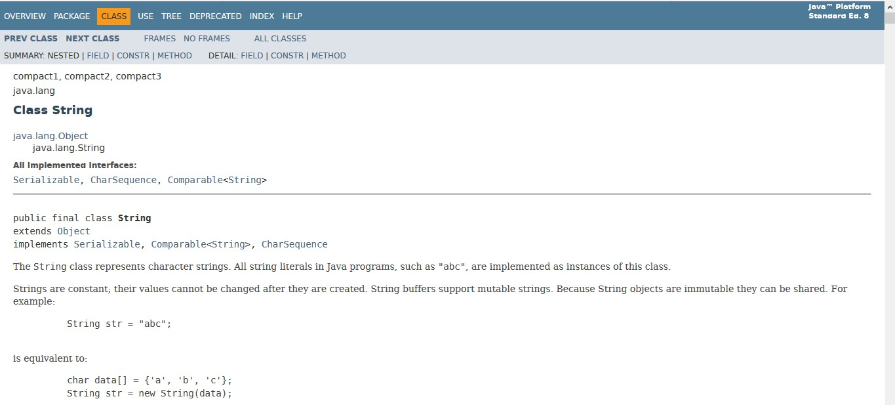

# **Tutorial 9: Packaging & Java API**

Dasar-dasar Pemrograman 2 - CSGE601021 | Fakultas Ilmu Komputer, Universitas Indonesia,
Semester Genap 2017/2018

**Dibuat oleh A Lone Tenno**

* * *

Selama ini, pengerjaan tutorial anda lakukan dengan mengimplementasikan sendiri sebagian besar program yang diperlukan. Mungkin anda tidak banyak memanfaatkan kode yang telah disediakan oleh bahasa pemrograman yang anda gunakan (Java), hanya sebagian kecil (Scanner untuk Input, System.out untuk output). Pada tutorial ini, anda tidak hanya diperbolehkan, namun juga sangat disarankan, untuk meng-explore  dan menggunakan library yang dimiliki oleh Java.

## **Tujuan Pembelajaran**
1. Memahami konsep Packaging
2. Dapat memahami & menggunakan dokumentasi Java API
3. Dapat menggunakan library yang telah disediakan Java
4. Dapat membuat komentar dokumentasi (Javadoc) yang cukup baik

### **Before You Start...**

0. Pray.
1. **[`PENTING`]** Lakukan `git pull upstream master` dengan menggunakan command prompt atau terminal kesayangan anda pada folder repository lokal Anda.
2. Kami sudah menyiapkan tempat untuk mengerjakan soal pada `lab_9/src/main/java`. Letakkan source code yang anda buat pada folder tersebut, tersusun sesuai bagaimana anda mendefinisikan package untuk kode-kode tersebut.
3. Ingat untuk add & commit dalam pengerjaan. Add & commit tidak harus dilakukan di akhir saat akan melakukan push. Ini bermanfaat sebagai semacam "checkpoint" saat anda mengerjakan tugas (selesai mengimplementasi method X, perbaikan class X, dll). Pastikan commit message yang anda gunakan deskriptif! >:)
3. Jangan lupa untuk push pekerjaan anda. Kode yang akan diperiksa dan didemokan pada asisten adalah kode yang anda push ke repository GitLab anda masing-masing **sebelum waktu deadline yang telah ditentukan** (defaultnya adalah 1 minggu setelah soal lab di-publish)

## **Materi Tutorial**

Materi tutorial untuk lab kali ini tidak sebanyak materi-materi lab yang membahas Object-Oriented Programming (Lab 5, 6, 7, 8). 

### **Packaging**

Pada beberapa tutorial sebelumnya, anda tentunya telah menggunakan deklarasi package pada class-class yang anda buat. Contohnya deklarasi berikut:
```java
package something;

public class A{
	// ...
}
```

 Namun, apa sih package itu? Untuk apa kita perlu package?

 
#### **Definisi**
(Dikutip dan diterjemahkan dari [tutorial Java pada Oracle](https://docs.oracle.com/javase/tutorial/java/package/packages.html)):
	"Suatu _package_ adalah pengelompokan sejumlah _type_ (Class/Interface/dll) yang berkaitan, menyediakan proteksi akses dan manajemen _name space_"

Kita dapatkan dari sini bahwa suatu package kita gunakan untuk mengelompokkan sejumlah Class/Interface/sebagainya yang saling berkaitan. Tentunya dapat dilihat bahwa ini akan bermanfaat bila kita membuat suatu program yang memerlukan banyak sekali class, sehingga kita perlu tahu class-class mana saja yang berkaitan.

Disebutkan juga bahwa penggunaan package "_menyediakan proteksi akses_". Apa maksudnya?
Kita coba ingat-ingat lagi materi yang telah diberikan pada Lab 4, mengenai **access specifier**. Singkat saja, ada 4 access specifier di Java. Ketentuannya mengenai access specifier yaitu:

| **Access modifier** | **Class** | **Package**  | **Subclass** | **Global** |
| --- | :---: | :---: | :---: | :---: |
| private | ✅ | ❎ | ❎ | ❎ |
| default | ✅ | ✅ | ❎ | ❎ |      
| protected | ✅ | ✅ | ✅ | ❎ |  
| public | ✅ | ✅ | ✅ | ✅ |
✅ : Bisa diakses

❎ : Tidak bisa diakses

Contoh baca: sesuatu (variable/method/etc) dengan access specifier _default_ hanya dapat diakses dari class itu sendiri atau dari package yang sama, namun tidak dapat diakses dari subclassnya (bila tidak dari package yang sama), ataupun dari global (class lain yang bukan dari package yang sama)

Dengan memanfaatkan packaging, sesuatu yang access specifiernya kita jadikan default hanya dapat diakses dari class itu sendiri atau dari package yang sama. Kita bisa manfaatkan ini untuk kasus-kasus di mana suatu informasi (variable misalnya) hanya boleh diakses dan diubah oleh class-class pada package yang sama. (Ingat: default didapatkan dengan tidak menuliskan access specifier pada deklarasi variable/method/etc-nya. _keyword_ Java *default* digunakan bukan sebagai access specifier)

Selain itu, disebutkan juga bahwa package "menyediakan manajemen _name space_". Apa yang dimaksud dari pernyataan ini? Sebenarnya cukup sederhana. 
*Nama suatu tipe (class/interface/dll) tidak akan _conflict_ dengan nama yang sama pada package lain*. Contohnya adalah apabila kita mendeklarasikan suatu class Human pada package lab7 dan kita deklarasikan Human pada package lab8. Hal ini tidak masalah karena kedua class tersebut berada pada package yang berbeda.

#### **Deklarasi & Penamaan**
Untuk mendeklarasikan suatu class berada pada suatu package, digunakan statement berikut:
```java
package <namaPackage>;
```
Deklarasi ini harus diletakkan pada awal suatu source code (sebelum import statement ataupun header class)

Penamaan package, secara sintaks, sama seperti penamaan pada umumnya dalam Java - **bebas** (selama tidak diawali angka dan bukan merupakan _reserved keyword_ (public,int,default,dll)). Walaupun begitu, tentunya ada _best practice_ untuk penamaan. Konvensi penamaan yang kita gunakan adalah [Google Java Style](https://google.github.io/styleguide/javaguide.html), dimana disebutkan bahwa nama package ditulis dengan huruf kecil semua, dengan beberapa kata disambung (contoh: org.example.javacoding).

#### **Menggunakan Type dari Package Lain**
Misalkan kita memiliki suatu class **Mahasiswa** diletakkan pada package **universitas**. Kita ingin menggunakan class tersebut pada suatu class yang kita buat di package lain. Ada 2 cara untuk menggunakan class tersebut (di [sini](https://docs.oracle.com/javase/tutorial/java/package/usepkgs.html) disebutkan bahwa ada 3 cara, namun kami menganggap cara ke-2 dan 3 sebagai cara yang serupa):
1. Menggunakan nama lengkap class tersebut setiap kali digunakan
Nama lengkap yang dimaksud di sini adalah nama class tersebut lengkap dengan packagenya, sehingga class Mahasiswa tersebut kita sebut sebagai universitas.Mahasiswa. Contoh penggunaannya adalah:
```
universitas.Mahasiswa mhs = new universitas.Mahasiswa(...);
...
public static universitas.Mahasiswa getMahasiswa() {
	...
}
```
Cara ini bisa digunakan, namun repot tentunya bila kita perlu mengetik nama package secara keseluruhan hingga nama classnya. Bagaimana jika classnya terletak dalam sub-package yang cukup dalam? Bagaimana jika memerlukan banyak class dari package tersebut? (contoh: java.util.function.Function, java.io.BufferedReader, dll)
Ini membawa kita pada cara ke-2:
2. Menggunakan _import statement_
Bila kita ingin menggunakan suatu class dari package lain, kita dapat _meng-import_ class tersebut agar dapat kita gunakan tanpa menyebutkan nama package dari class tersebut. Contohnya pada class mahasiswa tadi, kita dapat menggunakan:
```
import universitas.Mahasiswa;
```
Kemudian kita dapat menggunakan class Mahasiswa tersebut:
```
Mahasiswa mhs = new Mahasiswa();
```
(Access specifier masih berlaku di sini. Kita tetap tidak bisa mengakses variable/method/dll yang dideklarasikan _default_)
Bila kita memerlukan banyak class dari package yang sama, kita lakukan import pada statement terpisah:
```java
import universitas.Mahasiswa;
import universitas.Staff;
import universitas.Dosen;
...
```
Alternatifnya, kita dapat menggunakan karakter _wildcard_ untuk mengimport semua class/interface/dll pada package tersebut:
```java
import universitas.*;
```
(cara import ini tidak melibatkan sub-package yang terdapat dalam package yang diimport. Sub-package tersebut perlu diimport pada statement terpisah)

**Catatan**: Class/Interface yang terdapat pada package java.lang tidak perlu diimport dan dapat langsung digunakan. Contoh class yang terdapat pada package ini adalah Math, System, dan String.

#### **Menyusun File**
File yang berada dalam suatu package diletakkan dalam folder/direktori yang namanya sesuai dengan nama package tersebut. Agar lebih jelas, contohnya kita memiliki class:
```java
Mahasiswa (package universitas)
Dosen (package universitas)
MataKuliah (package universitas.kuliah)
MataKuliahMinat (package universitas.kuliah)
Masjid (package universitas.fasilitas)
Asrama (package universitas.fasilitas)
```
Maka susunan filenya adalah:
```
./
...universitas/
.....Mahasiswa.java
.....Dosen.java
.....kuliah/
.......MataKuliah.java
.......MataKuliahMinat.java
.....fasilitas/
.......Masjid.java
.......Asrama.java
```

Tutorial selengkapnya dapat dibaca di [The Java(tm) Tutorials - Packages](https://docs.oracle.com/javase/tutorial/java/package/index.html)

### **Java API**

Sebentar, sebentar.... API? Apa itu? Kebakaran? _Java kebakaran?_ **Java mbakar?**

#### **Apa itu API? (Penjelasan Singkat)**

Tenang, tenang! Bukan kebakaran atau api! API yang kita maksud di sini itu singkatan dari **Application Programming Interface**. Untuk dapat lebih mengerti apa itu API, kita umpamakan saja menu pada restoran, atau layanan-layanan pada hotel, adalah API dari suatu aplikasi. Kita dapat melihat apa saja yang bisa kita pesan atau minta, kemudian restoran/hotel tersebut akan memberikan layanan yang kita minta. Kita tidak perlu tahu apa yang terjadi di balik sana (misalnya bagaimana menyiapkan makanannya, bagaimana memilih orang untuk mengurus _room service_). Kita menyebutkan apa yang kita mau (dan membayar) dan kita terima layanan tersebut. Itu saja. (Penjelasan didapatkan dari [How-To Geek: What is an API?](https://www.howtogeek.com/343877/what-is-an-api/), dengan sedikit tambahan. Mungkin bukan analogi yang baik ataupun tepat, namun diharapkan dapat lebih memberikan gambaran).

#### **Pengenalan API di Java**

Seperti halnya yang telah disebutkan, Java juga memiliki API yang dapat kita manfaatkan agar dapat mempermudah pekerjaan kita. Sebagai contoh, bila kita ingin melakukan operasi matematika: pemangkatan, kita dapat menggunakan **Math.pow()** yang dimiliki Java. Bila kita ingin menulis ke file atau membaca dari file, Java memiliki package **java.io** yang di dalamnya terdapat class-class yang dapat melakukan hal tersebut. Kita ingin mengurutkan sebuah Array atau ArrayList? Java juga punya! Pertanyaannya, **bagaimana kita mempelajarinya, memahaminya, dan tentunya, menggunakannya?**

#### **Dokumentasi API Java**

Oracle menyediakan [dokumentasi Java API](https://docs.oracle.com/javase/8/docs/api/) yang di dalamnya menjelaskan berbagai macam package, class, dan sebagainya yang dimiliki Java. Contoh pada link sebelumnya adalah dokumentasi untuk Java 8 API. Dokumentasi untuk versi Java lainnya (Java 7 atau Java 9 misalnya) juga ada dan dapat dicari.

#### **Contoh: String dalam Java**

Sebagai contoh, kita dapat melihat dokumentasi untuk class [java.lang.String](https://docs.oracle.com/javase/8/docs/api/java/lang/String.html).

Pada halaman tersebut, kita dapat melihat berbagai macam informasi terkait class tersebut (macam-macam Constructor yang dapat digunakan, method-method yang tersedia, dll). Kita dapat melihat penjelasan terkait tiap method, return typenya, dan sebagainya. 
Kita ambil contoh pada method [charAt()](https://docs.oracle.com/javase/8/docs/api/java/lang/String.html#charAt-int-).
")
Dijelaskan apa yang dilakukan oleh method tersebut ("_Returns the char value at the specified index. An index ranges from 0 to length() - 1. The first char value of the sequence is at index 0, the next at index 1, and so on, as for array indexing. If the char value specified by the index is a surrogate, the surrogate value is returned._"). Selain itu dijelaskan pula parameter yang digunakan ("_index - the index of the char value._") serta return valuenya ("_the char value at the specified index of this string. The first char value is at index 0._"). Di awal tiap penjelasan, diberikan header dari method yang dijelaskan ("public char charAt(int index)") sehingga jelas access specifiernya (kita tahu siapa yang bisa mengakses), static atau non-static (jelas apakah perlu object atau tidak agar dapat digunakan), return typenya, nama methodnya (jelas...), serta tipe dan urutan parameternya. Terakhir, terdapat penjelasan mengenai _Exception_ (yang akan anda segera pelajari) terkait method tersebut.

#### **Dokumentasi Kode: Komentar Javadoc**

Kita sudah melihat contoh dokumentasi API milik Java. Kita lihat bahwa dokumentasi tersebut sangat berkaitan dengan bagaimana kode umumnya didefinisikan (ada header dari method, ada nama argumen-argumen dari parameter, ada return type dan value, dan sebagainya). Nah, mungkin saja ada yang bertanya, apa dokumentasi tersebut dibuat manual pada halaman web, terpisah dari kode? Apa header dari method, parameter, dan sebagainya yang ada pada dokumentasi dicocokkan secara manual dengan kode yang ada?

Jawabannya **tidak**! Dokumentasi tersebut sebenarnya **secara otomatis dibuat berdasarkan komentar tertentu yang ada pada source code**. Komentar yang bagaimana? Kita sebut komentar yang dijadikan dokumentasi tersebut adalah **komentar Javadoc**. Bagaimana menuliskan komentar tersebut pada kode?

Ada 3 macam komentar pada Java. Komentar jenis pertama dapat kita sebut _line comment_, diawali dengan "//". Dari awal komentar tersebut hingga akhir baris dianggap sebagai komentar.
```java
// this is a line comment
```
Komentar jenis kedua dapat kita sebut _block comment_, komentar yang diawali "/* " dan diakhiri "*/". Dari pembuka hingga penutup, semuanya dianggap komentar, walaupun terpisah pada beberapa baris.
```java
/* this
   is
   a
   block
   comment
   
   not sparta
*/
```
Komentar jenis ketiga yaitu _Javadoc comment_, diawali dengan "/**" dan diakhiri dengan "*/". Seperti block comment, dimulai dari pembuka hingga penutup semuanya dianggap komentar walaupun terpisah pada beberapa baris
```java
/** this
    is
	a
	Javadoc
	comment
*/
```
Sekarang kita tahu 3 cara menuliskan comment pada java. Agar dokumentasi seperti yang tadi kita lihat dapat terbentuk, dimana kita harus meletakkan Javadoc comment, dan apa saja yang ditulis?

Sebuah Javadoc comment dituliskan tepat sebelum header dari **class/interface, instance/class variable, constructor, dan method**. Suatu Javadoc comment umumnya terdiri dari 2 bagian: **deskripsi** dan **_block tag_**. Komentar Javadoc ditulis seperti menulis HTML (sehingga terdapat tag seperti `<code>`, dll). Berikut contoh komentar Javadoc pada method charAt(int) milik String (diambil dari [GrepCode: java.lang.String](http://grepcode.com/file_/repository.grepcode.com/java/root/jdk/openjdk/6-b14/java/lang/String.java/?v=source)):
")
Terlihat bahwa komentar tersebut menjelaskan apa yang dilakukan oleh charAt(int), dan apa yang terdapat pada komentar tersebut sesuai dengan apa yang ada pada dokumentasi. Selain itu, terdapat juga baris-baris yang menyatakan "`param ....`", "`return ....`". Baris baris tersebut diawali dengan tag (`param`, `return`, ....) dan dilanjutkan dengan penjelasan. Untuk tag `param`, perlu diikuti dengan nama argumen (pada kasus charAt, nama argumennya adalah _index_), kemudian diikuti penjelasan. Pada `return`, langsung diikuti oleh penjelasan.

Penjelasan lebih lengkap terkait penulisan dan penggunaan komentar Javadoc dapat dilihat pada [Oracle - How to Write Doc Comments for the Javadoc Tool](http://www.oracle.com/technetwork/articles/java/index-137868.html).

## **Soal Tutorial: Attending Events**

### **What's the story?**

**"Kebanyakan cerita, kak!"**

Bosan membaca semua cerita soal lab-lab tutorial DDP2 selama ini, teman (?) anda yang satu ini, si Z, memutuskan untuk datang ke berbagai acara yang diadakan di sekitar kampus. Namun, karena acaranya banyak sekali, ia bingung mau menghadiri yang mana saja, dan makin bingung lagi ketika tertarik mengikuti suatu acara padahal berencana menghadiri banyak acara lain (yang mungkin waktunya tabrakan!). Belum lagi ia perlu memikirkan total biaya yang perlu dikeluarkan untuk menghadiri semua acaranya.

Daripada bingung terus-terusan dan akhirnya tidak hadir di satupun acara, si Z meminta bantuan anda untuk membuatkan sebuah sistem yang akan membantu dia (dan orang lain) yang ingin menghadiri berbagai acara.

### **Spesifikasi**

Anda diberikan beberapa file berisi rancangan awal program yang digunakan untuk menyelesaikan permasalahan yang dimaksud. Anda **dibebaskan** untuk mengubah rancangan program tersebut dan menyesuaikan bagaimana anda ingin memakainya. Beberapa hal yang wajib ada yaitu:

***
#### class EventSystem
Class ini merepresentasikan sistem yang memiliki **daftar pengguna dan acara**. Sistem dapat mendaftarkan seorang pengguna ke dalam suatu acara, sehingga daftar acara yang direncanakan akan dihadiri pengguna tersebut bertambah.

Method-method yang dimiliki oleh class ini:

###### `String addUser(String name)`
Method ini digunakan untuk menambahkan seorang pengguna ke dalam sistem. Hanya pengguna yang terdaftar dalam sistem yang boleh mendaftar pada suatu acara. 
Catatan: Sistem ini masih sangat baru sehingga belum dapat menggunakan KTM/KTP untuk identifikasi. Dalam sistem, **tidak boleh ada 2 atau lebih pengguna dengan nama sama**. Pengguna yang mendaftar namun namanya sudah terdaftar akan **ditolak**.
Kembalian method ini berupa String, dengan ketentuan berikut:
- Bila pengguna berhasil ditambahkan, kembalikan String `User userName berhasil ditambahkan!` (gantikan "userName" dengan nama user yang ditambahkan).
- Bila pengguna gagal ditambahkan (karena sudah ada pengguna dengan nama sama), kembalikan String `User username sudah ada!` (gantikan "userName" dengan nama user yang ditambahkan).

###### `String addEvent(String name, String startTimeStr, String endTimeStr, String costPerHourStr)`
Method ini digunakan untuk menambahkan sebuah acara ke dalam sistem. Pengguna hanya boleh mendaftar ke acara yang terdaftar. 
Beberapa hal yang perlu diperhatikan mengenai method ini:
- Seperti user, **tidak boleh ada beberapa acara dengan nama sama**. Acara yang akan ditambahkan namun namanya sudah terdaftar akan **ditolak**.
- **Parameter kedua** (`String startTimeStr`) dan ketiga (`String endTimeStr`) merupakan representasi String dari waktu mulai dan selesai acara. String ini berbentuk "yyyy-MM-dd_HH:mm:ss" (tahun-bulan-hari_jam:menit:detik). Anda diberikan kebebasan bagaimana merepresentasikan waktu mulai dan selesainya suatu acara pada program ini. Apakah akan tetap menggunakan String tersebut, atau menggunakan tipe data int untuk tiap satuan (tahun,bulan,dst), atau ada cara lainnya? Semua dibebaskan pada anda. (Silahkan konsultasi dengan dokumentasi API Java bila perlu). String yang diinputkan dijamin merupakan String yang valid untuk diproses menjadi waktu (sesuai format yang telah disebutkan). **Hati-hati** bila waktu mulai > waktu selesai!
- **Parameter ketiga** merupakan String yang merepresentasikan biaya yang perlu dibayar pengguna yang menghadiri acara. Mengapa String? Ternyata biaya untuk hadir dalam suatu acara bisa **sangat besar** bahkan bisa melebihi batas tipe data bilangan bulat _primitive_ milik Java (`long`). Bagaimana solusinya? Nah itu kalian perlu cari sendiri. Namun, dapat dipastikan bahwa biaya tersebut berupa bilangan bulat.

Kembalian method ini berupa String, dengan ketentuan berikut:
- Bila waktu mulai > waktu selesai, kembalikan String `Waktu yang diinputkan tidak valid!`
- Bila acara berhasil ditambahkan, kembalikan String `Event eventName berhasil ditambahkan!` (gantikan "eventName" dengan nama acara yang ditambahkan).
- Bila acara gagal ditambahkan (karena sudah ada acara dengan nama sama), kembalikan String `Event eventName sudah ada!` (gantikan "eventName" dengan nama acara yang ditambahkan).


###### `String registerToEvent(String userName, String eventName)`
Mengatur agar pengguna dengan nama `userName` berencana menghadiri acara `eventName`. Penambahan rencana ini berhasil jika pengguna tidak memiliki acara yang waktunya bertabrakan dengan acara yang akan ditambahkan (misalnya, acara kedua dimulai sebelum acara pertama selesai). Jika waktu selesai suatu acara bertepatan dengan waktu mulainya acara lain (misalnya acara A selesai jam 8:00, acara B mulai jam 8:00 pada hari yang sama), pengguna masih dapat mengikuti acara tersebut (entah bagaimana caranya).
Ketentuan return value adalah sebagai berikut:
- Bila pengguna dan acara yang dicari tidak ada, kembalikan String `Tidak ada pengguna dengan nama userName dan acara dengan nama eventName!` (gantikan "userName" dengan nama user dan "eventName" dengan nama acara).
- Bila tidak ada pengguna dengan nama `userName`, kembalikan String `Tidak ada pengguna dengan nama userName!` (gantikan "userName" dengan nama user yang dicari).
- Bila tidak ada acara dengan nama `eventName`, kembalikan String `Tidak ada acara dengan nama eventName!` (gantikan "eventName" dengan nama user yang dicari).
- Bila pengguna sudah berencana menghadiri acara yang akan bertabrakan dengan event yang akan ditambahkan, kembalikan String `userName sibuk sehingga tidak dapat menghadiri eventName!`  (gantikan "userName" dengan nama user dan "eventName" dengan nama acara).
- Bila pengguna berhasil menambahkan acara ke list acara yang akan dihadiri, kembalikan String `userName berencana menghadiri eventName!`  (gantikan "userName" dengan nama user dan "eventName" dengan nama acara).

***
#### class Event
Class ini merepresentasikan suatu acara. Suatu _Event_ memiliki **nama**, **waktu mulai**, **waktu selesai**, serta **biaya** untuk hadir di acara tersebut.

Method-method yang dimiliki class ini:

###### `String getName()`
..... perlu dijelaskan?

###### `String toString()`
Mengembalikan representasi String dari objek acara ini. Format dari String yang perlu dikembalikan adalah:

```java
(Nama acara)
Waktu mulai: (Waktu mulai, tanggal-bulan-tahun, jam:menit:detik)
Waktu selesai: (Waktu selesai, tanggal-bulan-tahun, jam:menit:detik)
Biaya kehadiran: (Biaya)
```

Contoh (tidak dihitung apakah mungkin dengan durasi sekian dapat menghasilkan biaya tersebut, karena hanya sebagai contoh format!)

```java
UTS DDP2
Waktu mulai: 19-09-2005, 12:00:00
Waktu selesai: 19-09-2005, 18:20:00
Biaya kehadiran: 11111112490128490127489017013750897102398758091273586231785672301958921357861237856091237598123410001231000000023333311111110200000000000000
```

Catatan: Bulan yang ditulis disini menggunakan Bahasa Inggris

###### `<tipe tentukan sendiri> getCost()`
Accessor untuk instance variable yang menyatakan biaya. Perhatikan bahwa tipe dari method ini belum ditentukan. Anda perlu menentukan sendiri tipe yang cocok untuk method ini.

***
#### class User
Class ini merepresentasikan seorang pengguna yang ingin menghadiri acara-acara. _User_ memiliki **nama** dan **list acara** yang akan dihadiri.

Method-method yang dimiliki class ini:

###### `String getName()`
.......... yes

###### `boolean addEvent(Event newEvent)`
Menambahkan acara ke dalam list acara yang akan dihadiri, bila acara yang akan ditambahkan tersebut tidak bertabrakan dengan acara lain yang sudah ada dalam rencana. Mengembalikan true bila berhasil menambahkan acara tersebut, false bila gagal.

###### `ArrayList<Event> getEvents()`
Mengembalikan list acara yang direncanakan akan dihadiri oleh pengguna. Acara-acara dalam list ini diurutkan sesuai waktu mulainya. (Bagaimana? Silahkan dicari tahu....)
Note: ArrayList yang dikembalikan seharusnya merupakan duplikat dari list sesungguhnya milik pengguna. Mengapa? Bila list sesungguhnya dikembalikan secara langsung, maka list tersebut dapat diubah-ubah dan perubahannya tersebut terjadi pada list yang asli. Bagaimana melakukan duplikat untuk mencegah hal tersebut? Coba cari-cari....

###### `<tipe tentukan sendiri> getTotalCost()`
Mengembalikan biaya yang perlu dikeluarkan pengguna untuk menghadiri semua acara yang telah direncanakan (berada dalam list). Perhatikan bahwa tipe dari method ini belum ditentukan. Anda perlu menentukan sendiri tipe yang cocok untuk method ini.
***

### **Input/Output**
Pada Lab 9 ini, tidak ada input/output. Jalankan Lab9Main.java yang sudah disediakan. Bila implementasi yang anda lakukan sudah benar, maka output yang anda dapatkan seharusnya sesuai dengan sample output yang tertera berikut.

```
User Mahasiswa Teladan berhasil ditambahkan!
User Mahasiswa Baru berhasil ditambahkan!
User Mahasiswa Teladan sudah ada!
Event UTS DDP2 berhasil ditambahkan!
Event UTS DDP1 berhasil ditambahkan!
Event UTS DDP2 sudah ada!
Event Asis SDA Forever berhasil ditambahkan!
UTS DDP2
Waktu mulai: 21-05-2016, 11:02:34
Waktu selesai: 21-05-2016, 14:00:00
Biaya kehadiran: 2000421412210
Asis SDA Forever
Waktu mulai: 21-05-2017, 11:20:34
Waktu selesai: 21-05-2018, 15:00:00
Biaya kehadiran: 123000000000000000000000123456789000000000000000001234567891234567800000000000000000000000000000000012345678912345678912345678900000000000000000000000000000000000000000001234567893456789123456789000000000000000123456789123456789000000000000000000123456789123456789123456789123456789123456789
Mahasiswa Baru berencana menghadiri UTS DDP2!
Mahasiswa Teladan berencana menghadiri UTS DDP1!
Tidak ada pengguna dengan nama Mahasiswa Abadi dan acara dengan nama UTS DDP3!
Mahasiswa Baru sibuk sehingga tidak dapat menghadiri UTS DDP1!
Tidak ada pengguna dengan nama Mahasiswa Abadi!
Mahasiswa Teladan berencana menghadiri Asis SDA Forever!
User Mahasiswa suka makan berhasil ditambahkan!
Event Makan siang berhasil ditambahkan!
Event Makan telat berhasil ditambahkan!
Event Sarapan berhasil ditambahkan!
Event Makan malam berhasil ditambahkan!
Event Ngoding seharian berhasil ditambahkan!
Mahasiswa suka makan berencana menghadiri Makan malam!
Mahasiswa suka makan berencana menghadiri Makan telat!
Mahasiswa suka makan sibuk sehingga tidak dapat menghadiri Ngoding seharian!
Mahasiswa suka makan berencana menghadiri Sarapan!
Mahasiswa suka makan berencana menghadiri Makan siang!
Sarapan
Waktu mulai: 20-01-2014, 06:30:00
Waktu selesai: 20-01-2014, 07:00:00
Biaya kehadiran: 10000
Makan siang
Waktu mulai: 20-01-2014, 12:30:00
Waktu selesai: 20-01-2014, 13:00:00
Biaya kehadiran: 15000
Makan malam
Waktu mulai: 20-01-2014, 19:30:00
Waktu selesai: 20-01-2014, 20:00:00
Biaya kehadiran: 20000
Makan telat
Waktu mulai: 20-01-2014, 22:30:00
Waktu selesai: 20-01-2014, 23:00:00
Biaya kehadiran: 35000
Biaya Mahasiswa suka makan: 80000
UTS DDP1
Waktu mulai: 21-05-2016, 11:00:00
Waktu selesai: 21-05-2016, 12:00:00
Biaya kehadiran: 451234412000
Asis SDA Forever
Waktu mulai: 21-05-2017, 11:20:34
Waktu selesai: 21-05-2018, 15:00:00
Biaya kehadiran: 123000000000000000000000123456789000000000000000001234567891234567800000000000000000000000000000000012345678912345678912345678900000000000000000000000000000000000000000001234567893456789123456789000000000000000123456789123456789000000000000000000123456789123456789123456789123456789123456789
Biaya Mahasiswa Teladan: 123000000000000000000000123456789000000000000000001234567891234567800000000000000000000000000000000012345678912345678912345678900000000000000000000000000000000000000000001234567893456789123456789000000000000000123456789123456789000000000000000000123456789123456789123456789123457240357868789
Biaya Mahasiswa Baru: 2000421412210
```

Catatan: Karena angka yang tidak karuan pada contoh output ini, anda sebaiknya tidak mencoba mencocokkan output anda dan output yang ada di sini secara manual. Manfaatkan alat-alat yang sudah ada! Contoh: [Diffchecker](http://diffchecker.com/)

### **Dokumentasi**

Pada materi di atas (dan pada link yang diberikan) telah dijelaskan bagaimana cara membuat komentar Javadoc. Pada lab kali ini, anda **sangat disarankan untuk latihan menuliskan dokumentasi Javadoc** pada method-method yang ada pada class-class yang anda gunakan.

### **Hint - PENTING!**

Pada Lab 9 ini, anda sangat disarankan untuk menggunakan Library yang disediakan oleh Java untuk membantu pekerjaan anda. Tidak ada salahnya bila anda ingin mengerjakannya sendiri (tanpa memanfaatkan library Java selain yang biasa anda gunakan), namun mungkin akan lebih mudah bila anda mempelajari library yang dimiliki Java yang terkait dengan hal-hal yang perlu digunakan di sini.

Beberapa hint yang mungkin membantu:
- Java memiliki library yang dapat merepresentasikan waktu. Contohnya yaitu `java.util.Calendar` (dan `java.util.GregorianCalendar`), serta package `java.time`.
- Untuk melakukan pengurutan, java memiliki `Arrays.sort()` (pada `java.util.Arrays`) dan `Collections.sort()` (pada `java.util.Collections`) agar anda tidak perlu mendefinisikan bagaimana cara melakukan pengurutan (sorting) dari awal. Tetapi untuk menggunakan kedua method tersebut, anda perlu menggunakan suatu interface yang bernama `Comparable` (`java.lang.Comparable`). Silahkan anda pelajari interface tersebut dan bagaimana penggunaannya pada kedua method di atas.
- Terkait bilangan bulat yang bahkan melebihi `long` tadi, ternyata Java juga memiliki suatu class yang dapat meng-handle masalah tersebut. Class ini terletak dalam suatu package yang mengatasi masalah matematika....

## Checklist

Isi kurung siku komponen dengan x untuk menceklis komponen.

### Komponen Wajib | 100 Poin

- [ ] **Melengkapi instance variable pada class Event sesuai kebutuhan (waktu mulai & selesai, biaya)**
- [ ] **Mengimplementasikan method & constructor yang diperlukan pada class Event dengan benar (constructor, toString, method untuk memeriksa overlap bila perlu)**
- [ ] **Mengimplementasikan method yang diperlukan pada class User dengan benar (addEvent, getEvents[copy+sort], getTotalCost)**
- [ ] **Mengimplementasikan method yang diperlukan pada class EventSystem dengan benar (addUser, addEvent, registerToEvent)**

### Komponen Bonus | 10 Poin

- [ ] **Memberi komentar Javadoc yang sesuai di seluruh bagian kode yang perlu didokumentasikan (class,field,method,constructor)**
- [ ] **Menggunakan class/interface/dll dari Java API yang cocok untuk mendukung pengerjaan**

-----
### **Woah, apa ini !?**

Ketika kalian meng-push hasil kerja kalian, kalian akan sadar bahwa ada logo cross merah atau centang hijau di samping hasil kerja kalian.


Kalian mungkin memperhatikan bahwa kita mulai memakai sistem git sejak semester 2, mengikuti kakak angkatan kalian yang baru mulai memakai sistem git sejak semester 3. Salah satu guna dari menggunakan git adalah kita bisa menggunakan fitur Continuous Integration?

Apa itu Continuous Integration? Continuous Integration adalah konsep di mana ketika kalian push, hasil push kalian langsung di build (compile) dan di test (uji langsung). Jika gagal, kalian akan diberitahu.

Bagian Build baru akan dijelaskan di mata kuliah Advanced Programming. Kalian hanya perlu mengetahui bagian test.

Sistem yang digunakan untuk mengetest di Java bernama JUnit. Kita bisa menggunakan framework JUnit untuk mengetes secara langsung (tanpa harus print di command line). Untuk sekarang, kalian tidak perlu tahu cara kerja JUnit.

Kamu dapat memeriksa hasil kerja Junit di tab Commit. Tekan logo centang hijau atau cross merah untuk memeriksa detail lebih lanjut.


Ketika kamu menekan logo tersebut, kamu akan memeriksa rangkuman dari tes tersebut yang memiliki dua lingkaran.

Jika lingkaran pertama cross, maka program kamu gagal karena compile error.
Jika lingkaran pertama centang hijau tetapi lingkaran kedua cross, maka program kamu tidak akurat.
Jika kedua lingkaran centang, berati program kamu sudah baik.


Kamu dapat menekan tombol cross merah atau centang hijau untuk melihat hasil lebih lanjut. Sebagai contoh, jika kalain mendapat cross merah di lingkaran kedua, kamu dapat menemkan cross merah kedua untuk melihat test case mana program kalian tidak akurat.